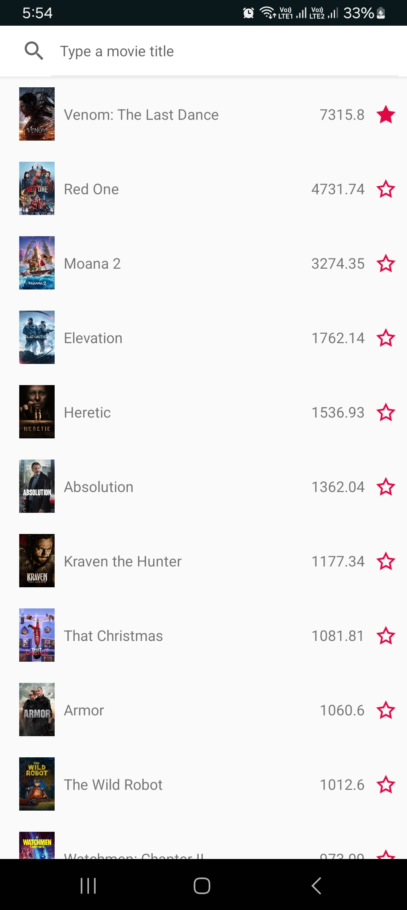
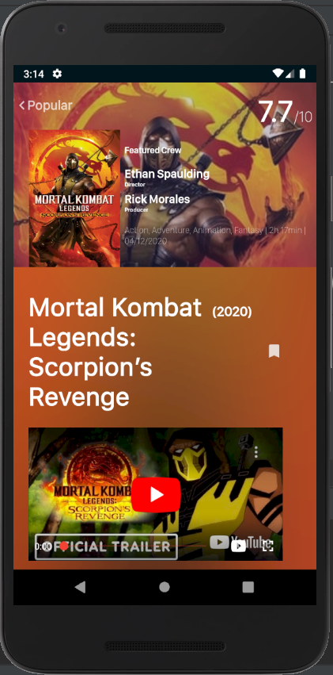
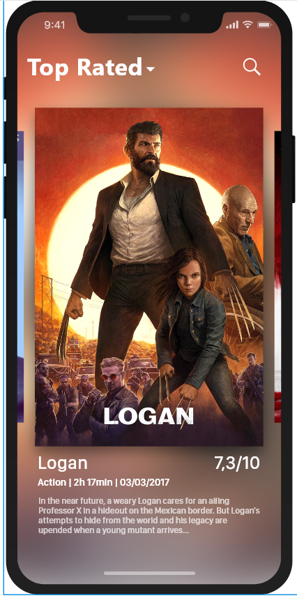

# Dewansh_TMDB App
---
## Authors: [Dewansh Kaushik]
---
> This program is an Android Mobile Application.  
> It can be launched with an Android Simulator (included with Android Studio).  
> It fetches data from TMDB ([The Movie Database](https://www.themoviedb.org/)) API.

> It's written in __Java programming language including some libraries like so:__
+ [Picasso](https://square.github.io/picasso/)
+ [RecyclerView](https://developer.android.com/jetpack/androidx/releases/recyclerview)
+ [Retrofit 2](https://square.github.io/retrofit/)
+ [RxJava 2/RxAndroid](https://github.com/ReactiveX/RxJava)
+ [Room](https://developer.android.com/jetpack/androidx/releases/room)
+ [Lifecycle](https://developer.android.com/topic/libraries/architecture/lifecycle)
+ [OkHttp 3 Logging Interceptor](https://github.com/square/okhttp/tree/master/okhttp-logging-interceptor)
+ [CircleImageView](https://github.com/hdodenhof/CircleImageView)
+ [Swipe Refresh Layout](https://developer.android.com/jetpack/androidx/releases/swiperefreshlayout)
+ [Android Youtube Player](https://github.com/PierfrancescoSoffritti/android-youtube-player)

---
## Implementations

> Here is described some implemented features:
> + First view with a list of items (RecyclerView)
> + Second view describing the selected item including texts, videos and horizontal recyclerview.
> + Webservice call to a RESTful API.
> + Cached data into a Room SQLite Database.
> + MVVM Architecture
> + Singleton design pattern for Room implementation
> + Gitflow (permanent: master|develop) (temporary: features|releases)
> + Design quite responsive
> + SOLID Principles

---
## How the mobile app works ?
### First Activity: List of the last popular films

> When launching the application, the list of the popular films are fetched from the API and displayed into the view.
> You can then slide down to discover the new popular films.

### Second Activity
> On clicking over a film, we can find its name, authors, trailer, actors and its synopsis

---
## Improvements
> In order to improve this application we could implement:
> + The other calls to the API in the Retrofit contract
> + Improve the first view so it will be like this one: 

  

> + Push notifications (Firebase implementation)
> + Other HTTP call method (POST, PUT, DELETE, OPTIONS) to create authentication in the application
---
## Last Release Version: 0.1.1
### Changelog:
> #### Version 0.1.1
>  README.md.
---
> #### Version 0.1.0
> Added Triplet implementation to encapsulate three classes inside one.  
> Added new converter for handling String[] integration in the Room Database.  
> Added CrewModel, CastModel and Credits POJO class to handle Arraylist of crews and casts.  
> Added the deserializer CreditsJsonDeserializer to deserialize the credits response.  
> Added new register type adapter to the APIClient to handle credits response of the API.  
> Improved MovieModel and refactored the MovieDetailsActivity.  
> Refactored MovieViewModel.getPopularMoviesOnline() method to handle more concisely RxJava2 calls from Retrofit2 and make it more suitable using FlatMaps. 
---
> Adding of API Management classes with the adaptation of RxJava2 in Retrofit2.  
> Adding of JsonDeserializer used by the GsonFactory to only retrieve the results array object of MovieModel in the response of the API.  
> Adding 5 requests to handle respectively:
> + Latest movies
> + Now Playing movies
> + Popular movies
> + Top Rated movies
> + Upcoming movies
---
> Adding of utils for network availability test and dates formatting.
---
